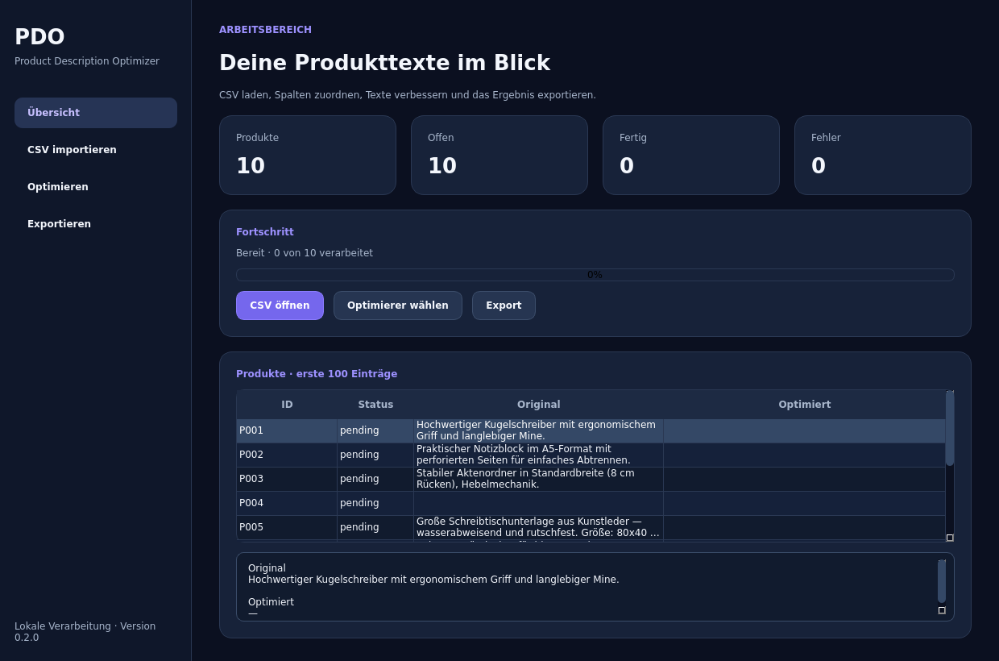

# PDO — Product Description Optimizer

PDO is an AI-powered desktop app and CLI for importing, improving, reviewing, and exporting product descriptions from CSV files. It preserves the original columns and supports both cloud and locally hosted AI models.



## What it does

- **Guided CSV workflow:** Preview the file, detect common delimiters and encodings, and map columns before import.
- **Flexible AI integration:** Connect cloud or locally hosted models. Built-in adapters currently support Google Gemini, ZhipuAI, and OpenAI-compatible servers such as Ollama or LM Studio.
- **Reviewable results:** Watch progress, inspect original and revised descriptions, pause or resume between products, and export completed rows.
- **Local project state:** SQLite stores progress after every product so a stopped run can continue with remaining rows.
- **Desktop and automation:** Use the PySide6 application on Linux or Windows, or the existing CLI and daemon on Linux.

## Install

Download a Linux `.AppImage` or `.deb`, or a Windows `.exe` installer from [GitHub Releases](https://github.com/PaDreyer/product-description-optimizer/releases) once a version is published. The packages contain the desktop application and provider libraries; they do not require a separate Python installation. Linux packages currently require glibc 2.36 or newer, as provided by Debian 12 and Ubuntu 24.04.

To run from source, use Python 3.12 or newer:

```bash
git clone https://github.com/PaDreyer/product-description-optimizer.git
cd product-description-optimizer
./scripts/setup-dev.sh
source venv/bin/activate
pdo-desktop
```

On Windows, run `.\scripts\setup-dev.ps1` in PowerShell and activate
`venv\Scripts\Activate.ps1`.

Choose a CSV file, mark at least one column as **Description**, select an AI backend, and export the completed rows. API keys entered in the desktop app are saved in `~/.pdo/config.toml`; on Linux the file is created with owner-only permissions. Environment variables `GEMINI_API_KEY` and `ZHIPUAI_API_KEY` also work.

The demo backend changes text to uppercase and is meant only to check the import and export flow. Choose an AI backend for useful descriptions. A local server must already be running and have the model you enter in the app. Cloud providers receive the mapped description and context fields; use a local server when the product data must stay on your computer.

## CLI

The Unix-socket daemon and CLI are available for scripts on Linux. Stop the daemon before opening the desktop app because both use the same local database.

```bash
python -m pip install -e '.[gemini,zhipuai,openai]'
pdo daemon start
pdo import products.csv -m product_id:ProduktID -m description:Beschreibung -m context:Marke
pdo optimize --optimizer gemini --watch
pdo export optimized-products.csv
```

See [Getting Started](docs/getting_started.md) and the [CLI Reference](docs/cli_reference.md) for the full command set and configuration options.

## Development

```bash
./scripts/setup-dev.sh
make lint
make test
```

The tag-triggered [release workflow](.github/workflows/release.yml) builds Linux AppImage and Debian packages in a Docker container and a Windows installer with Inno Setup. It checks the tag against the project version, runs tests, and publishes packages with SHA-256 checksums. See [Release guide](docs/RELEASE.md).

## License

[MIT](LICENSE)
